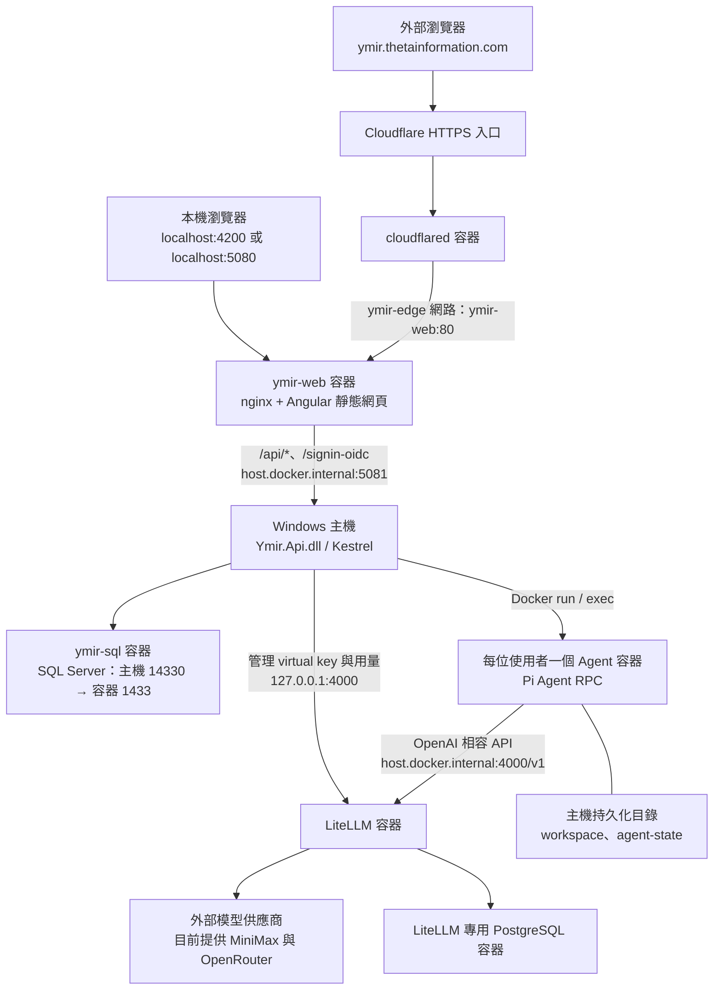
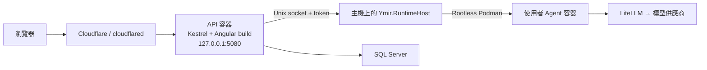

# Ymir 目前架構

Ymir 是企業 AI 平台，目前的子產品為 **Vibe Maker**：使用者透過對話，讓 Pi Agent 在自己的隔離執行環境中建立工具、網站與檔案。前端使用 Angular 22，後端為 .NET 10 的模組化單體，透過 REST API 與 SSE 傳遞資料及執行事件。

本文以 **2026-10-07 本機實際部署**為主，另列出程式碼支援的開發與 Linux 部署架構。

## 本機實際部署（Windows + Docker Desktop）

目前 API 在 Windows 主機以 Production 模式執行；網頁、nginx、Agent、模型代理及資料庫在 Docker Desktop 的 Linux 容器內執行。API 直接管理 Docker Agent 容器，目前沒有另啟動 Ymir.RuntimeHost。

### 服務與連接埠

| 元件 | 執行位置 | 入口或連線 | 責任 |
|---|---|---|---|
| Angular + nginx | `ymir-web` 容器，映像 `localhost/ymir/web:model-access-20261007` | `127.0.0.1:4200`、`127.0.0.1:5080` → 容器 `80` | 提供 Angular 靜態網頁、SPA 路由及 API 反向代理 |
| Ymir API | Windows 背景程序 `dotnet Ymir.Api.dll` | `127.0.0.1:5081` | 登入、授權、專案、對話、附件、Agent 執行與管理功能 |
| SQL Server | `ymir-sql` 容器 | `127.0.0.1:14330` → 容器 `1433` | Ymir 業務資料 |
| Agent runtime | `ymir-user-{userId}` 容器，映像 `localhost/ymir/agent-runtime:deliverables` | API 透過 Docker 管理，無對外服務埠 | 執行 Pi Agent、工具與檔案操作 |
| LiteLLM | `ymir-litellm-litellm-1` 容器 | `127.0.0.1:4000` → 容器 `4000` | 模型路由、每位使用者的 virtual key、預算與用量 |
| PostgreSQL | `ymir-litellm-litellm-db-1` 容器 | 容器 `5432`，未發布主機連接埠 | LiteLLM 的金鑰與用量資料 |
| Cloudflare Tunnel | `ymir-tunnel-cloudflared-1` 容器 | 對外建立 Tunnel；內部連到 `http://ymir-web:80` | 將公開 HTTPS 網域導向本機網頁入口 |

`start-ymir.ps1` 會啟動既有 Docker 容器，並透過 `%LOCALAPPDATA%\Ymir\deploy\run-api.ps1` 啟動 Windows API；它不負責建置或重建容器。部署產物位於 `%LOCALAPPDATA%\Ymir\deploy`。

### nginx 所在位置與代理行為

nginx **1.31.6** 執行在 `ymir-web` 的 Linux 容器內，因此 Windows 程序清單不會出現 `nginx.exe`。目前瀏覽器使用的 `localhost:4200` 是 nginx 入口。

- 容器內設定檔：`/etc/nginx/conf.d/default.conf`。
- 靜態網頁目錄：`/usr/share/nginx/html`。
- `/api/*` 與 `/signin-oidc` 轉送到 `http://host.docker.internal:5081`。
- API 代理關閉回應緩衝與快取，讀取逾時設為 3,600 秒，供 SSE 持續串流。
- `/api/dev/*`、`/health`、`/alive` 在此入口被阻擋；其他網頁路徑以 `index.html` 處理 SPA 路由。
- nginx 設定與靜態網頁已封裝在映像中；目前 `ymir-web` 沒有掛載外部設定檔。

### 上傳大小限制

應用程式允許單一附件 **50 MiB**（`50 × 1024 × 1024` bytes），nginx 的 `server` 區塊也已設定 `client_max_body_size 50m;`，兩層限制一致。超過此上限的請求會回傳 **413 Request Entity Too Large**。

原先 6,781,783 bytes 的 PDF 因 nginx 預設 `1m` 被擋住；2026-10-07 已修正執行中的設定、重新載入 nginx，並同步更新部署來源 `%LOCALAPPDATA%\Ymir\deploy\web-model-access-20261007\nginx.conf` 及 `localhost/ymir/web:model-access-20261007` 映像。以未登入的大小探測請求確認：6,781,783 bytes 已通過 nginx 大小檢查並收到 API 的 401；50 MiB + 1 byte 仍由 nginx 回傳 413。此檢查未建立附件。

## 應用程式分層

後端採模組化單體：同一個 API 程序承載共用平台及 Vibe Maker；各模組有自己的核心、基礎設施及資料 schema。

| 專案／目錄 | 職責 |
|---|---|
| `web/` | Angular UI：登入、專案、對話、檔案、執行事件與管理介面；API 型別由 OpenAPI 產生 |
| `src/Ymir.Api/` | ASP.NET Core Host：HTTP 端點、BFF 認證、授權、XSRF、速率限制與背景服務組裝 |
| `src/Ymir.Edge/` | 對外入口政策：可信任代理、Host 限制、安全標頭及 Angular 靜態網頁託管能力 |
| `src/Platform/` | 共用使用者、身份、本機帳號、系統設定與稽核；資料 schema 為 `platform` |
| `src/Modules/VibeMaker/Ymir.VibeMaker/` | Domain + Application：專案、對話、附件、執行狀態及 Runtime／Harness／Model Gateway 抽象 |
| `src/Modules/VibeMaker/Ymir.VibeMaker.Infrastructure/` | EF Core、背景執行與事件發布、Pi RPC、Docker／Podman／Remote runtime、LiteLLM 串接 |
| `src/Modules/VibeMaker/Ymir.VibeMaker.Contracts/` | API DTO 與 SSE 事件契約 |
| `src/Ymir.RuntimeHost/` | 支援容器化 API 的主機執行服務，管理 Agent 容器並轉送程序 stdio |
| `src/Ymir.AppHost/` | Aspire 本機開發編排 |
| `src/Ymir.ServiceDefaults/` | 共用健康檢查與 OpenTelemetry |
| `runtime/agent/` | Pi Agent 容器映像定義 |
| `deploy/` | API、RuntimeHost、LiteLLM 與 Cloudflare Tunnel 的部署範本 |

Runtime 與 Harness 分離：Runtime 負責隔離環境與程序啟動；Harness 負責 Pi 協定、事件轉換及完成／失敗／取消結果。模組間以識別碼關聯資料，不建立跨模組外鍵。

## 登入、執行與資料流

### 登入與授權

API 採 BFF + HttpOnly Cookie，可支援 Entra ID OIDC 與本機帳號。前端不保存 IdP token；修改資料的請求需要 XSRF 驗證。API 在每次請求檢查帳號狀態，並驗證專案、對話及檔案的擁有者；管理端點另要求 Admin 權限。

### Agent 執行與串流

1. 瀏覽器透過 REST API 建立專案、對話及訊息；附件先上傳，再以附件 ID 綁定訊息。
2. API 建立 execution，由背景 worker 執行，生命週期與單次 HTTP 請求分離。
3. Runtime 確保使用者容器存在，Harness 在容器內透過 RPC 啟動 Pi Agent。
4. Pi 使用該使用者的 LiteLLM virtual key 呼叫模型，並在工作目錄執行工具。
5. 執行事件先寫入 SQL Server，再發布；瀏覽器透過 SSE 接收輸出、工具事件及最終狀態。
6. 成功執行後，後端只登記本次 `deliverables/{executionId}/` 中的交付成果，保存於 `vibemaker.execution_artifacts`；回覆下載卡片使用此紀錄，不以工作目錄的檔案變化推測成果。

同一位使用者的對話共用一個 Agent 容器，專案與獨立對話各有工作目錄。Agent 容器不持有模型供應商金鑰、LiteLLM master key 或 Ymir 資料庫連線字串。

### 資料與檔案存放

| 資料 | 存放位置 |
|---|---|
| 使用者、本機登入資料、系統設定、稽核 | SQL Server 的 `platform` schema |
| 專案、對話、訊息、附件中繼資料、執行與事件 | SQL Server 的 `vibemaker` schema |
| LiteLLM virtual key 與用量 | LiteLLM 專用 PostgreSQL |
| Agent 產生及使用者上傳的檔案 | 使用者 workspace，持久化至 Windows 主機 |
| Pi 狀態 | 使用者 `agent-state`，持久化至 Windows 主機 |

目前 workspace 根目錄是 `C:\Users\sean.ma\Documents\ymir-workspaces`，每位使用者的 `users/{userId}/workspace` 與 `users/{userId}/agent-state` 分別掛載到容器的 `/workspace` 與 `/agent-state`。

容器內的專案目錄為 `/workspace/projects/{projectId}`，獨立對話目錄為 `/workspace/chats/{conversationId}`，ID 使用不含連字號的 GUID。上傳檔案放在對應工作目錄的 `uploads/`；SQL Server 保存附件關聯與中繼資料，檔案內容保存在 workspace。

## 其他支援的部署架構

### Aspire 本機開發

`Ymir.AppHost` 編排 SQL Server、Fake LLM、API 與 Angular 開發伺服器。Angular 使用 `localhost:4200`，由 `web/proxy.conf.mjs` 將 API 與 OIDC callback 轉送到 Aspire 提供的 API 位址，未提供時預設 `http://localhost:5080`。

此模式不需要 nginx。預設為 Scripted Harness；可切換 Pi。Local runtime 僅允許 Development，沒有容器隔離。這與上方目前正在執行的 Windows Production 部署是不同模式。

### Linux 容器化 API + RuntimeHost

`src/Ymir.Api/Containerfile` 將 Angular build 包進 API 映像，由 API 提供網頁；此範本不依賴獨立 nginx。API 使用 `Runtime.Provider=Remote`，透過 `/run/ymir-runtime/runtime.sock` 與 token 呼叫主機 RuntimeHost。

RuntimeHost 以主機上的專用帳號管理每位使用者的 Rootless Podman 容器；API 容器不掛載 Docker／Podman socket 或使用者 workspace。Windows Docker 的容器化 API 範本則透過 `host.docker.internal:5090` 呼叫主機 RuntimeHost。這些是程式碼支援的部署方式，目前本機未使用此拓撲。

## 模型供應商與 OpenRouter

LiteLLM 統一代理 MiniMax 與 OpenRouter，對話使用原有模型選單。MiniMax-M2.7 保留為預設模型，另提供 Claude Sonnet 5.5、GPT-6.1 Sol 與 GPT-6 Luna（OpenRouter），三者皆支援圖片輸入及 Agent 工具呼叫。

OpenRouter API key 僅注入 LiteLLM，使用者與 Agent 使用限定模型的短效 virtual key；用量及預算沿用既有管理流程。路由、Models 與明確設定的 AllowedModels 必須使用相同 alias，更新後於無執行中工作時重啟 API，使模型選單及新發 key 同步。部署設定及新增模型方式見 [LiteLLM 部署說明](deploy/litellm/README.md)。

## 管理員開放模型

「管理 → 系統設定 → 開放模型」可勾選已接入的模型及指定預設，至少保留一個，並可還原部署設定。開放清單以 `vibemaker.model_access` 保存於既有 `platform.system_settings`，重啟後保留、不需要新 migration，管理員修改寫入稽核。

`GET/PUT/DELETE /api/admin/settings/models` 受 Admin／XSRF 保護；使用者的 `/api/models`、送出訊息、排隊工作啟動及 LiteLLM 新 virtual key 一致採用生效清單。已開始的工作繼續完成，下次執行模型集合改變時换發金鑰；尚未開始而模型被關閉的工作明確失敗。模型頁面載入與視窗回到前景時重新查詢。詳見 [ADR-0016](docs/adr/0016-admin-model-access.md)。

## 模型與思考設定

對話輸入區以滑桿圖示開啟設定面板，包含「選擇模型」與「思考深度」，圖示旁顯示目前選擇。模型文字只顯示名稱，保留 OpenRouter 風格的文字／圖片能力徽章。新對話、既有對話與專案共用面板，支援鍵盤選擇、Tab 移動到深度、Escape／點擊外部關閉及手機鍵盤空間調整。

深度依各模型的 `Thinking` 能力顯示，包含傳輸 Parameter、精確 Levels、DefaultLevel 與 Required；不固定套用相同選單。MiniMax M2.7 不顯示深度控制；GPT-6 Luna 可選關閉／輕量／標準／深入／更深入／最高，Sol 與 Sonnet 不提供關閉。自動採模型預設，不等於關閉。前端不向不支援的模型傳送保存偏好，後端在提交與執行開始驗證精確值；execution 保存所選值，排隊及冪等重送保留原值。

Pi 1.0.0 透過 `--thinking` 與每次執行的 models.json 明確對應傳輸值；OpenRouter 路由使用 `reasoning.effort` 經 LiteLLM 轉給供應商，其他已驗證的 OpenAI 相容路由可配置 `reasoning_effort`。自動不傳深度參數，明確關閉傳 none，不繼承 session 舊設定，也不將 xhigh／max 降成 high。token 預算或其他開關需新增 adapter 才能開放，不冒充 effort。詳見 [ADR-0018](docs/adr/0018-model-specific-thinking-capabilities.md)。驗證使用 `npm run e2e:model-picker -- <截圖目錄> <baseUrl>`、Agent 映像內的 `runtime/agent/test-thinking.mjs` 及 LiteLLM 的 `deploy/litellm/test-openrouter.py`，均使用本機假模型。

## 側欄導覽

側欄採固定圖示與一致列高，專案、聊天群組以標題及分隔線區分。頂部漢堡按鈕可收合／展開側欄；桌面記住收合狀態，手機顯示抽屜並支援 Escape、遮罩與導覽後關閉。

## 手機對話輸入區

新對話與既有對話的輸入框位於可見畫面底部，預留 8px 或手機底部安全區；手機隱藏冗長的鍵盤操作說明，模型選擇、附件與送出仍可使用。對話訊息獨立捲動，輸入區不隨訊息移動。Shell 使用動態 viewport 高度，並監聽 VisualViewport 的高度與位移，配合鍵盤開關；放大閱讀時不重新縮排，桌面維持既有配置。

版面檢查：`npm run e2e:mobile-composer -- <截圖目錄> <baseUrl>` 使用唯讀 API fixtures，驗證新舊對話、橫直向、長對話、多行輸入及附件、模擬鍵盤縮放／位移／收起、縮放閱讀與桌面還原。手機實機 Safari／Chrome 的原生鍵盤尚待驗證。

## 成果、專案檔案與工具暫存

### `/make` 文件引導與公告模板

輸入 `/help`，Agent 會先介紹 Ymir 的問答、附件分析、專案及成果建置用途，再說明目前只有 `/help` 與 `/make` 兩個斜線指令，並列出管理員開放的建置主題。這次只回覆說明，不建檔或提供下載成果。輸入 `/` 可看到兩個指令提示。

輸入 `/make` 可選擇小工具、網站、**建立簡報**與**建立公告 Word**。主題從 `vibemaker.make_topics` 載入，管理員可在「Make 主題」編輯建置指示、排序或停用。`DocumentMakeTopics` migration 只新增兩個文件主題，不覆寫既有自訂主題。

- 簡報：先確認目的、聽眾、頁數、素材及風格，確認逐頁大綱後產生可編輯 `.pptx`；Agent 映像預裝 `python-pptx` 與中文字型。
- 公告：先確認主旨、發布單位、日期、正文與聯絡資訊，確認草稿後依公司模板產生 `.docx`。模板保留使用者範例的 Logo、橫幅、背景與頁尾，移除原始活動、姓名及信箱；段落與條列可增減。
- 平台素材：`runtime/agent/templates/` 隨 Agent 映像部署至唯讀 `/opt/ymir/templates/`；公告建置器只替換 DOCX 正文，保留其他 package parts。來源範例不進版本庫或使用者工作目錄。
- 暫存 JSON／腳本放在 `.ymir/tmp/`，只有最終 PPTX／DOCX 放入本次成果目錄。部署時需套用 migration 並建置新 Agent 映像；既有容器須於沒有執行中的工作時重建，保留 workspace 與 agent-state。

詳見 [公告模板及欄位](runtime/agent/templates/announcement/README.md)與[簡報建置指引](runtime/agent/templates/presentation/README.md)。

- **成果**：每次執行使用獨立的 `deliverables/{executionId}/`。單一成果直接下載；多個檔案以後端 ZIP 交付並保留目錄結構，包含網站必要的 `package.json`、lockfile。純閱讀或摘要不建立下載卡片，除非使用者要求可下載的文件。
- **專案檔案**：工作目錄中的原始碼、設定與上傳附件，可在檔案面板切換查看或下載；不包含成果目錄及內部工具檔。
- **工具與暫存**：工具安裝使用 `.ymir/tools/`，處理過程使用 `.ymir/tmp/`，不提供列表、單檔下載或 ZIP 下載。Agent 映像預裝 `pdftotext`，避免單純解析 PDF 時在工作目錄根建立 npm 專案。
- **成果 API**：`GET /api/conversations/{id}/artifacts` 列出成功執行的成果；`/{executionId}/download?path=` 下載已登記的單檔；`/{executionId}/archive` 僅打包該次成果。同一個專案的對話共享成果，後端驗證擁有者、路徑、檔案大小與修改時間，拒絕 symlink、隱藏檔及依賴目錄。
- **相容性**：成果紀錄保存於資料庫，重新整理或重啟後仍可查詢。失敗／取消不發布成果，歷史檔案不追溯分類、不自動刪除；舊有工具設定檔仍可在專案檔案中看到。
