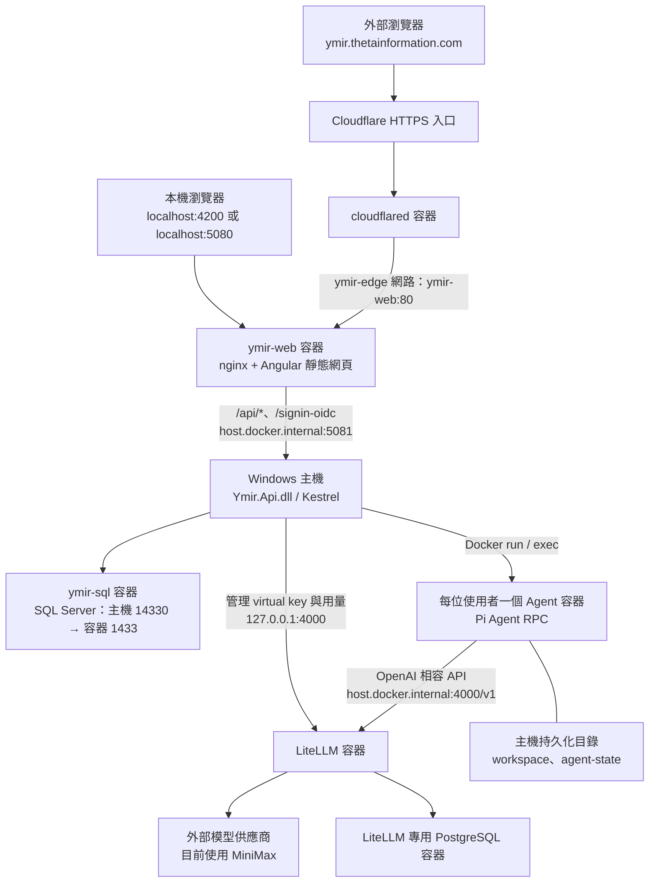
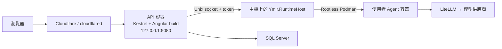

# Ymir 目前架構

Ymir 是企業 AI 平台，目前的子產品為 **Vibe Maker**：使用者透過對話，讓 Pi Agent 在自己的隔離執行環境中建立工具、網站與檔案。前端使用 Angular 22，後端為 .NET 10 的模組化單體，透過 REST API 與 SSE 傳遞資料及執行事件。

本文以 **2026-10-07 本機實際部署**為主，另列出程式碼支援的開發與 Linux 部署架構。

## 本機實際部署（Windows + Docker Desktop）

目前 API 在 Windows 主機以 Production 模式執行；網頁、nginx、Agent、模型代理及資料庫在 Docker Desktop 的 Linux 容器內執行。API 直接管理 Docker Agent 容器，目前沒有另啟動 Ymir.RuntimeHost。

### 服務與連接埠

| 元件 | 執行位置 | 入口或連線 | 責任 |
|---|---|---|---|
| Angular + nginx | `ymir-web` 容器，映像 `localhost/ymir/web:71b8e2c` | `127.0.0.1:4200`、`127.0.0.1:5080` → 容器 `80` | 提供 Angular 靜態網頁、SPA 路由及 API 反向代理 |
| Ymir API | Windows 背景程序 `dotnet Ymir.Api.dll` | `127.0.0.1:5081` | 登入、授權、專案、對話、附件、Agent 執行與管理功能 |
| SQL Server | `ymir-sql` 容器 | `127.0.0.1:14330` → 容器 `1433` | Ymir 業務資料 |
| Agent runtime | `ymir-user-{userId}` 容器，映像 `localhost/ymir/agent-runtime:dev` | API 透過 Docker 管理，無對外服務埠 | 執行 Pi Agent、工具與檔案操作 |
| LiteLLM | `ymir-litellm-litellm-1` 容器 | `127.0.0.1:4000` → 容器 `4000` | 模型路由、每位使用者的 virtual key、預算與用量 |
| PostgreSQL | `ymir-litellm-litellm-db-1` 容器 | 容器 `5432`，未發布主機連接埠 | LiteLLM 的金鑰與用量資料 |
| Cloudflare Tunnel | `ymir-tunnel-cloudflared-1` 容器 | 對外建立 Tunnel；內部連到 `http://ymir-web:80` | 將公開 HTTPS 網域導向本機網頁入口 |

`start-ymir.ps1` 會啟動既有 Docker 容器，並透過 `%LOCALAPPDATA%\Ymir\deploy\run-api.ps1` 啟動 Windows API；它不負責建置或重建容器。部署產物位於 `%LOCALAPPDATA%\Ymir\deploy`。

### nginx 所在位置與代理行為

nginx **1.31.6** 執行在 `ymir-web` 的 Linux 容器內，因此 Windows 程序清單不會出現 `nginx.exe`。目前瀏覽器使用的 `localhost:4200` 是 nginx 入口。

- 容器內設定檔：`/etc/nginx/conf.d/default.conf`。
- 靜態網頁目錄：`/usr/share/nginx/html`。
- `/api/*` 與 `/signin-oidc` 轉送到 `http://host.docker.internal:5081`。
- API 代理關閉回應緩衝與快取，讀取逾時設為 3,600 秒，供 SSE 持續串流。
- `/api/dev/*`、`/health`、`/alive` 在此入口被阻擋；其他網頁路徑以 `index.html` 處理 SPA 路由。
- nginx 設定與靜態網頁已封裝在映像中；目前 `ymir-web` 沒有掛載外部設定檔。

### 目前的上傳限制落差

應用程式允許單一附件 **50 MiB**（`50 × 1024 × 1024` bytes）。但目前 nginx 未設定 `client_max_body_size`，使用預設 `1m`，超過 1 MiB 的請求會在進入 API 前回傳 **413 Request Entity Too Large**。

已確認 6,781,783 bytes 的 PDF 被 nginx 記錄為 `client intended to send too large body`。這是目前部署的設定落差；需將 nginx 上限與應用程式上限對齊，並同步更新映像來源。本文件更新時尚未修正此設定。

## 應用程式分層

後端採模組化單體：同一個 API 程序承載共用平台及 Vibe Maker；各模組有自己的核心、基礎設施及資料 schema。

| 專案／目錄 | 職責 |
|---|---|
| `web/` | Angular UI：登入、專案、對話、檔案、執行事件與管理介面；API 型別由 OpenAPI 產生 |
| `src/Ymir.Api/` | ASP.NET Core Host：HTTP 端點、BFF 認證、授權、XSRF、速率限制與背景服務組裝 |
| `src/Ymir.Edge/` | 對外入口政策：可信任代理、Host 限制、安全標頭及 Angular 靜態網頁託管能力 |
| `src/Platform/` | 共用使用者、身份、本機帳號、系統設定與稽核；資料 schema 為 `platform` |
| `src/Modules/VibeMaker/Ymir.VibeMaker/` | Domain + Application：專案、對話、附件、執行狀態及 Runtime／Harness／Model Gateway 抽象 |
| `src/Modules/VibeMaker/Ymir.VibeMaker.Infrastructure/` | EF Core、背景執行與事件發布、Pi RPC、Docker／Podman／Remote runtime、LiteLLM 串接 |
| `src/Modules/VibeMaker/Ymir.VibeMaker.Contracts/` | API DTO 與 SSE 事件契約 |
| `src/Ymir.RuntimeHost/` | 支援容器化 API 的主機執行服務，管理 Agent 容器並轉送程序 stdio |
| `src/Ymir.AppHost/` | Aspire 本機開發編排 |
| `src/Ymir.ServiceDefaults/` | 共用健康檢查與 OpenTelemetry |
| `runtime/agent/` | Pi Agent 容器映像定義 |
| `deploy/` | API、RuntimeHost、LiteLLM 與 Cloudflare Tunnel 的部署範本 |

Runtime 與 Harness 分離：Runtime 負責隔離環境與程序啟動；Harness 負責 Pi 協定、事件轉換及完成／失敗／取消結果。模組間以識別碼關聯資料，不建立跨模組外鍵。

## 登入、執行與資料流

### 登入與授權

API 採 BFF + HttpOnly Cookie，可支援 Entra ID OIDC 與本機帳號。前端不保存 IdP token；修改資料的請求需要 XSRF 驗證。API 在每次請求檢查帳號狀態，並驗證專案、對話及檔案的擁有者；管理端點另要求 Admin 權限。

### Agent 執行與串流

1. 瀏覽器透過 REST API 建立專案、對話及訊息；附件先上傳，再以附件 ID 綁定訊息。
2. API 建立 execution，由背景 worker 執行，生命週期與單次 HTTP 請求分離。
3. Runtime 確保使用者容器存在，Harness 在容器內透過 RPC 啟動 Pi Agent。
4. Pi 使用該使用者的 LiteLLM virtual key 呼叫模型，並在工作目錄執行工具。
5. 執行事件先寫入 SQL Server，再發布；瀏覽器透過 SSE 接收輸出、工具事件及最終狀態。

同一位使用者的對話共用一個 Agent 容器，專案與獨立對話各有工作目錄。Agent 容器不持有模型供應商金鑰、LiteLLM master key 或 Ymir 資料庫連線字串。

### 資料與檔案存放

| 資料 | 存放位置 |
|---|---|
| 使用者、本機登入資料、系統設定、稽核 | SQL Server 的 `platform` schema |
| 專案、對話、訊息、附件中繼資料、執行與事件 | SQL Server 的 `vibemaker` schema |
| LiteLLM virtual key 與用量 | LiteLLM 專用 PostgreSQL |
| Agent 產生及使用者上傳的檔案 | 使用者 workspace，持久化至 Windows 主機 |
| Pi 狀態 | 使用者 `agent-state`，持久化至 Windows 主機 |

目前 workspace 根目錄是 `C:\Users\sean.ma\Documents\ymir-workspaces`，每位使用者的 `users/{userId}/workspace` 與 `users/{userId}/agent-state` 分別掛載到容器的 `/workspace` 與 `/agent-state`。

容器內的專案目錄為 `/workspace/projects/{projectId}`，獨立對話目錄為 `/workspace/chats/{conversationId}`，ID 使用不含連字號的 GUID。上傳檔案放在對應工作目錄的 `uploads/`；SQL Server 保存附件關聯與中繼資料，檔案內容保存在 workspace。

## 其他支援的部署架構

### Aspire 本機開發

`Ymir.AppHost` 編排 SQL Server、Fake LLM、API 與 Angular 開發伺服器。Angular 使用 `localhost:4200`，由 `web/proxy.conf.mjs` 將 API 與 OIDC callback 轉送到 Aspire 提供的 API 位址，未提供時預設 `http://localhost:5080`。

此模式不需要 nginx。預設為 Scripted Harness；可切換 Pi。Local runtime 僅允許 Development，沒有容器隔離。這與上方目前正在執行的 Windows Production 部署是不同模式。

### Linux 容器化 API + RuntimeHost

`src/Ymir.Api/Containerfile` 將 Angular build 包進 API 映像，由 API 提供網頁；此範本不依賴獨立 nginx。API 使用 `Runtime.Provider=Remote`，透過 `/run/ymir-runtime/runtime.sock` 與 token 呼叫主機 RuntimeHost。

RuntimeHost 以主機上的專用帳號管理每位使用者的 Rootless Podman 容器；API 容器不掛載 Docker／Podman socket 或使用者 workspace。Windows Docker 的容器化 API 範本則透過 `host.docker.internal:5090` 呼叫主機 RuntimeHost。這些是程式碼支援的部署方式，目前本機未使用此拓撲。
