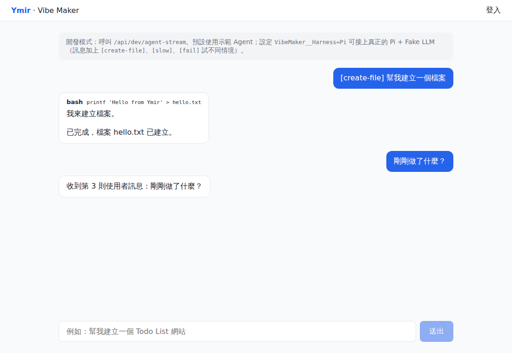
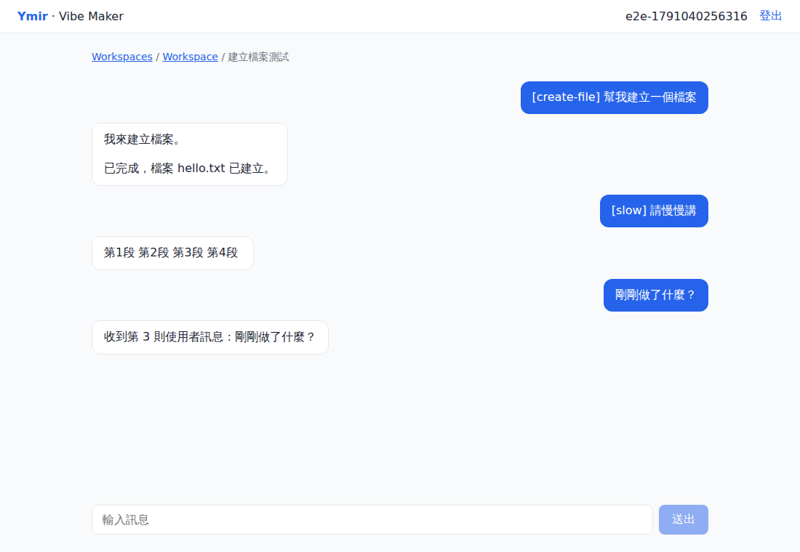

# Ymir / Vibe Maker 開發規劃

> 依據：[`docs/sa/vibe-maker-core-mvp-sa.md`](../sa/vibe-maker-core-mvp-sa.md)（SA v1.0）。
> 本文件記錄**對 SA 的修訂建議**與**修訂後的路線圖**；已定案的決策另以 ADR 記錄於 [`docs/adr/`](../adr/)。

## 已確認的前提

| 項目 | 決定 |
|---|---|
| 命名 | **Ymir** 是母平台，**Vibe Maker** 是第一個子產品。共用核心 `Ymir.Platform.*`，Vibe Maker 模組 `Ymir.VibeMaker.*`（[ADR-0001](../adr/0001-modular-monolith-and-naming.md)） |
| MVP 範圍調整 | 加入**唯讀 Workspace 檔案瀏覽 / 檢視 / zip 下載** |
| 開發方式 | **全 AI 開發**：文件、測試、CI 是 AI 的護欄，見 §3 |
| Agent Harness | Pi，套件為 `@earendil-works/pi-coding-agent`（原 `@mariozechner/pi-coding-agent`），鎖版 1.0.0 |

---

## 對 SA 的修訂建議

### 1. Sprint 順序改成「風險優先 + Walking Skeleton」

SA 把 Auth 放 Sprint 1、Podman 放 Sprint 4。但 OIDC 是成熟技術，**真正的未知是 Pi 協定 + Rootless Podman + LiteLLM 串起來**。而且 SA 的 Sprint 3 要跑 Agent，卻要到 Sprint 4 才有 Container，Sprint 3 只能把 Agent 跑在 Host 上，之後重工。

→ 加 **Sprint 0 技術驗證**；Sprint 1 就打通「最細的端到端鏈路」（Dev 登入 → 送訊息 → Container 內 Pi → SSE），之後逐層加厚。

### 2. 「Hardening 放最後」改成「一開始就內建」

Cancel、timeout、重啟後 reconciliation、狀態機會決定 execution pipeline 的核心結構，放到 Sprint 5 才補等於重寫。

→ 第一版 pipeline 就帶 CancellationToken、狀態機與 timeout；最後一個 Sprint 只做驗收、壓測與補洞。

### 3. 全 AI 開發 → AI 要讀得懂、改得動、驗得了

- **SA 以 Markdown 放進 repo**（docx 在 git 無法 diff，AI 也難以精準引用）；原 docx 保留在 `documents/`。
- **`CLAUDE.md`**：專案結構、建置/測試指令、分層規則、安全紅線。
- **ADR**：每個重要決策一頁，避免後續 AI session 推翻前面的決定。
- **測試是 AI 唯一可靠的回饋迴路**：
  - Fake LLM（OpenAI 相容假模型，可腳本化 tool call）—— 已在 `tests/Ymir.Testing.FakeLlm`
  - Testcontainers（SQL Server）
  - **授權矩陣測試**：每個 API × 非擁有者 → 必須 403/404（對應驗收條件 #2）
- **契約自動生成**：.NET 10 內建 OpenAPI → 產生 Angular TypeScript client，前後端不手寫兩份 DTO。
- **CI 必過 + 雲端 session 啟動 hook**，每個 PR 是一個小垂直切片。

### 4. 認證改用 BFF + Cookie（[ADR-0002](../adr/0002-bff-cookie-auth-for-sse.md)）

瀏覽器原生 `EventSource` **不能帶 Authorization header**。SPA + Bearer 的話，SSE 要嘛把 token 放 query string（會進 log），要嘛自己用 fetch 解析串流。BFF（.NET 後端做 OIDC，前端只拿 HttpOnly Cookie）讓 SSE 直接可用，token 也不落在瀏覽器。

- 開發期用 **Dev Auth Handler / 本機 mock OIDC**，不被「企業 IdP 待確認」卡住。
- USER 唯一鍵用 **issuer + subject（Entra 的 `oid`）**，不要用帳號 / UPN（會改名）。

### 5. SSE 可靠性設計（SA 未涵蓋）

- Execution 與 HTTP request 解耦：背景 worker（Channel queue）執行，SSE 端點只是訂閱者。
- 事件帶遞增 `id:`，暫存 / 持久化，支援 `Last-Event-ID` **斷線續傳**（重新整理頁面、Proxy 斷線都很常見）。
- 心跳（comment line）、反向代理關閉 buffering。.NET 10 內建 `TypedResults.ServerSentEvents`。
- 抽象 `IExecutionEventBus`：MVP in-memory，將來 API 多實例時換 Redis。

### 6. Pi 整合具體化（[ADR-0003](../adr/0003-pi-rpc-via-podman-exec.md)）

- 每次 execution：`podman exec -i <container> pi --mode rpc --session-dir /agent-state/sessions --session-id <agent_session_id>`，stdin/stdout JSONL 對接；Cancel 送 `{"type":"abort"}`，逾時再 kill。
- **Pi session 檔必須放在持久化 volume**（`/agent-state`），不能在 container home，否則 container 重建後 Agent 失憶。DB 的 MESSAGE 是 UI 的真實來源；Pi session 遺失時由 MESSAGE 重建（降級）。
- 事件映射：`message_update/text_delta → assistant.delta`、`tool_execution_start/end → tool.started/completed`（只送摘要）、`agent_settled → execution.completed`。
- 企業內網設定 `PI_OFFLINE=1`、`PI_SKIP_VERSION_CHECK=1`、`PI_TELEMETRY=0`；鎖定 Pi 版本。
- .NET 端用 `System.Diagnostics.Process` 呼叫 podman CLI（比透過 Docker 相容 API attach stdio 簡單）。

### 7. LiteLLM 憑證改用 Virtual Key（[ADR-0004](../adr/0004-litellm-virtual-keys.md)）

Agent 在 container 裡有 shell，**用環境變數注入的 key 一定讀得到**。

→ Runtime Manager 為每個 runtime 向 LiteLLM 申請 **virtual key**（限模型、限預算、有效期），外洩影響有限；同時取得 per-user 用量，讓 Phase 2「Usage & Quota」提前有基礎。

> **Sprint 0 實測**：virtual key 需要 LiteLLM 搭配 PostgreSQL，部署需多一個資料庫（或改用 API 轉發的替代方案），見 ADR-0004。

### 8. 網路 Egress 的矛盾需先決定

SA 範例「建立 Todo List 網站」需要 `npm install`，但 SA §7 又規定預設只能連必要服務。

→ 需要決定：**內部套件鏡像（Nexus / Verdaccio）** 或 **allow-list egress proxy**。已列入下方待確認清單。

### 9. 資料模型補強

- `AGENT_EXECUTION` 加 `client_request_id`（`UNIQUE(user_id, client_request_id)` 實作冪等）、`runtime_id`、`correlation_id`、`created_at`；`MESSAGE` 加 `execution_id`。
- 新增 `AUDIT_LOG`（SA §12 要求卻沒定義表）與 `EXECUTION_EVENT`（SSE 續傳用）。
- 用 **filtered unique index** 讓 DB 保證「同 Conversation 只有一個 QUEUED/RUNNING」「每 Workspace 只有一個未刪除 runtime」；狀態轉移用 `rowversion` 樂觀鎖。
- `AGENT_RUNTIME.status` 補上 lifecycle 圖（SA §6.2）中的 `DELETED`，兩邊一致。

### 10. Podman 實務坑

- Rootless + bind mount 的 **UID 對應**（`--userns=keep-id` 或 `:U`）、SELinux（`:Z`）、**NAS/NFS 與 rootless 的相容性**。
- 建議旗標：`--cap-drop=ALL --security-opt no-new-privileges --pids-limit --read-only --tmpfs /tmp --memory --cpus`，不 mount podman socket。詳見 [`runtime/agent/README.md`](../../runtime/agent/README.md)。
- 冷啟動時間：預拉 image，UI 顯示「正在準備 Runtime」。
- **Sprint 0 實測**：rootless Podman 在 cgroups v1 會忽略 `--memory`/`--cpus`/`--pids-limit`，正式主機必須 cgroups v2 + systemd delegation；`sleep infinity` 需搭配 `--init`。

### 11. 唯讀檔案瀏覽的安全重點

API 讀 host 端 workspace 時，**Agent 可能在 workspace 建 symlink 指向 `/etc` 等路徑**。

→ 必須解析 realpath 並確認仍在該 workspace root 內，拒絕 `..` 與 symlink 逃逸；限制單檔大小；zip 下載要串流。

### 12. 開發體驗與可觀測性

- **.NET Aspire AppHost** 一鍵起 API + Angular + SQL Server + LiteLLM（支援 Podman）。
- **OpenTelemetry** 取代自訂 correlation_id（`traceparent` 一路傳到 LiteLLM），開發期用 Aspire Dashboard 看 trace。

### 13. 架構分層精簡（[ADR-0001](../adr/0001-modular-monolith-and-naming.md)）

SA §19 建議 5 個專案。改為**模組化單體**：每個模組一個「Domain + Application」專案（資料夾分層）+ 一個 Infrastructure 專案，專案參考自然保證 Application 不依賴 Podman / Pi。各模組擁有自己的 DB schema（`platform.*`、`vibemaker.*`），跨模組只以 ID 參照。

---

## Sprint 0 成果

技術驗證全部通過（Pi RPC 串流、tool call、session 續接、container 重建後續接、abort、模型錯誤、經過 LiteLLM、container 安全設定、workspace 隔離），
細節與發現見 [`spikes/pi-rpc-poc/README.md`](../../spikes/pi-rpc-poc/README.md)。

開發用聊天頁（真實 Pi → Fake LLM → SSE → Angular）：

## Sprint 1 成果

Walking Skeleton 打通：Dev 登入（Cookie + XSRF）→ Workspace / 對話 → 背景執行 Agent → SSE（可續傳）→ 歷史保存；
資料庫保證並行規則、授權矩陣涵蓋所有 API、啟動時 reconciliation。紀錄見 [Sprint 1 看板](../progress/board-sprint-1.md)。

---

## 修訂後的路線圖

| Sprint | 範圍 | Done Definition |
|---|---|---|
| **0** | 技術驗證 + 骨架 | Pi RPC + Fake LLM 實測通過（串流、tool call、session 續接、abort）；.NET / Angular 骨架可 build/test；CI 綠燈 |
| 1 | Walking Skeleton | Dev 登入 → 建 Workspace/Conversation → 送訊息 → Container 內 Pi → SSE 顯示；含 cancel/timeout 狀態機、EF Core + migrations |
| 2 | 正式認證 | OIDC + BFF Cookie、User upsert（issuer+sub）、Admin/User、授權矩陣測試、Disabled 使用者阻擋 |
| 3 | Chat 體驗 + 檔案瀏覽 | 完整 Chat UI、歷史訊息、SSE 續傳、唯讀檔案樹 / 檢視 / zip 下載 |
| 4 | Runtime 完整生命週期 | idle stop、resume/recreate、quota、reconciliation、Admin runtime 管理、LiteLLM virtual key |
| 5 | 驗收與強化 | Audit、OTel 指標、安全檢查、Playwright E2E 覆蓋 SA 12 項驗收條件 + 新增項 |

### 新增驗收條件（補充 SA §21）

13. SSE 斷線後以 `Last-Event-ID` 重連，不遺失、不重複事件。
14. Container 重建後，同一 Conversation 的 Agent 仍保有先前上下文（Pi session 在持久化 volume）。
15. 檔案瀏覽 API 無法透過 `..` 或 symlink 讀取 workspace 以外的檔案。
16. Container 內無法取得長效的 LiteLLM master key。

---

## 開發前待確認項目（補充 SA §23）

| 項目 | 建議預設 | 需要確認 |
|---|---|---|
| LiteLLM 資料庫 | 新增 PostgreSQL 給 LiteLLM | 公司是否允許 PostgreSQL；否則採 API 轉發方案（ADR-0004） |
| Podman 主機 | RHEL 9 / Ubuntu 24.04（cgroups v2） | 主機 OS 與版本、是否能設定 systemd delegation |
| 套件下載 / Egress | 內部套件鏡像（npm / PyPI / NuGet） | 公司是否已有 Nexus / Artifactory；或改用 allow-list egress proxy |
| LiteLLM Virtual Key | 每 runtime 一把、短效、限模型與預算 | 預算額度、可用模型清單、是否依部門分帳 |
| 企業 IdP | Entra ID（OIDC） | 實際為 Entra ID / ADFS / 純 LDAP？ |
| Workspace 存放 | 本機工作副本 + 日後以 Microsoft Graph 串接各使用者 OneDrive | 已選定方法二，僅記錄、尚未實作；見 [OneDrive Workspace 計畫](onedrive-workspace-plan.md)；待確認帳號類型、授權、同步與保存規則 |
| 資料保存 | Conversation / Workspace 永久保留，可封存 | 公司資料保存與刪除政策 |

---

## 前端網站託管與分享（後續開發）

使用者於 2026-10-07 提出：前端網站成果發布至獨立託管服務，提供穩定網址；可選公開、公司內部或指定使用者存取，發布後能管理分享名單。第一版分享限瀏覽，網站服務獨立於 Agent 容器生命週期。

詳細流程、架構方向、介面需求、開發階段、驗收及待確認事項見 [前端網站託管、發布與分享開發計畫](frontend-site-hosting-plan.md)。**目前僅記錄計畫，尚未實作**；後端／資料庫／SSR 應用部署另列範圍。

## 後台（系統設定）待辦功能

> 使用者於 2026-10-06 提出，**僅記錄、尚未實作**。目前這些值都放在部署主機的 `.env` 或 secret（見 `docs/guides/entra-id.md`、`docs/guides/cloudflare-tunnel.md`）。實作前要先寫新 ADR，因為兩項都會改變現有安全規則（ADR-0006、ADR-0009 與 CLAUDE.md 安全紅線）。

| # | 功能 | 內容 | 實作前要決定的事 |
|---|---|---|---|
| 1 | Microsoft Entra 登入設定 | 後台欄位：Tenant ID、Client ID、Client secret（只能寫入、不回顯，顯示到期日）、Admin app role、登入按鈕名稱、啟用 / 停用 | secret 存 DB 要用 Data Protection 加密；改設定後 OIDC handler 要重新載入而不必重啟；設定錯誤時不能把 Admin 鎖在外面（本機帳號登入保留為備援）；每次修改寫 audit |
| 2 | Cloudflare Tunnel 設定 | 後台欄位：Tunnel token（只能寫入、不回顯）、對外網域（hostname） | 目前 ADR-0006 規定 tunnel 憑證不得進 container，而 API 跑在容器內（ADR-0008），所以 token 不能交給 API 直接啟動 cloudflared；可能做法是由主機上的服務（例如 runtime host 或獨立的 edge 管理服務）保存 token、重啟 cloudflared，API 只轉送；對外網域變更時要同步更新 Entra 的 redirect URI（後台提示）與 `Ymir:PublicEdge` 的 Host 限制 |
